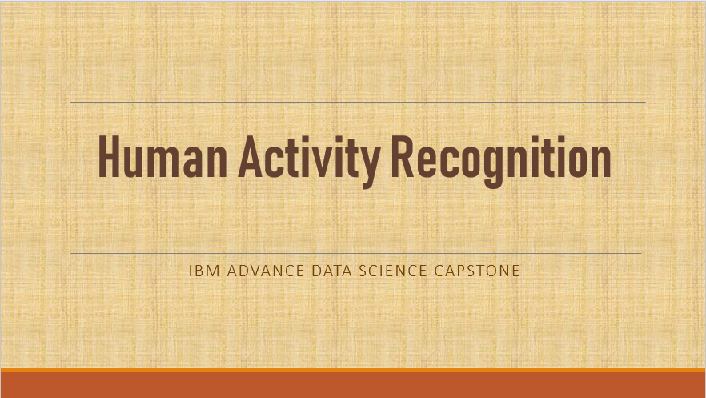

# IBM-Advance-Data-Science-Capstone

## The Dataset consist of 1.92 million reading in 3 dimensonal form taken from UCI ML repository.

### Columns:
### X-axis, Y-axis, Z-axis = 3 dimensional readings 
### Label = 7 different labels for each activity human is performing
### subject = participant number performing in the environment

## This project is divided into 2 notebooks

## From intial data exploration, pre-processing to visualization is in notebook  'From_Pre-processing_to_ETL_&_Vis' 

## For Model Selection, Feature Engineering and Results  'Model_Algorithm_result' 

## Video Presentation on Youtube : 
